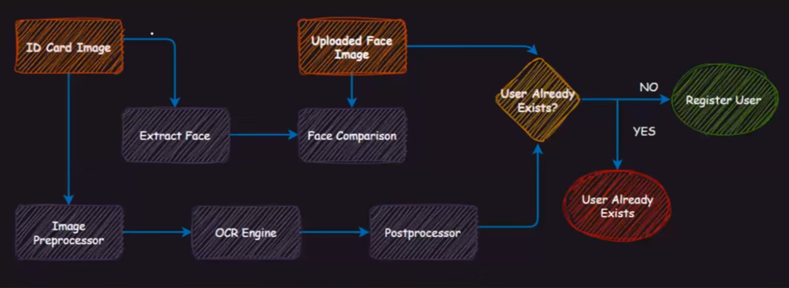

# EKYC using Computer Vision and NLP

## Image Processing and contour detection
After taking ID image as input I have applied various image transformations like gaussian blurring and adaptive thresholding so that I can easily apply contour detection for finding the ID-Card boundary and better text extraction.
To easily perform contour detection the uploaded image should have a clear background.

## OCR (Optical Character Recognition)

Optical Character Recognition (OCR) is a technology used to convert different types of
documents, such as scanned paper documents, PDF files, or images captured by a digital
camera, into editable and searchable data. The primary function of OCR is to recognize
text within these documents and convert it into a machine-readable form.

Text extraction can be achieved in two steps, i.e., `text detection` and `text recognition` or by training a single model to achieve both text detection and
recognition. I'll me explaining the 2 steps process.

**Text detection helps identify the region in the image where the text is present. Ittakes in an image as an input, and the outputs bounding boxes.
Text recognition extracts the text from the input image using the bounding boxes
obtained from the text detection model. It takes in an image and some bounding boxes
as inputs and outputs some raw text.**

Text detection is very similar to the object detection task where the object which needs
to be detected is nothing but the text. We can use algorithms like RCNN, Faster-RCNN.
SSD, YOLO. Here, we will mainly focus on explaining the CRNN-CTC network for text
recognition.

After the text detection step, regions, where the text is present, are cropped and sent
through convolutional layers to get the features from the image. Later these features are
fed to many-to-many LSTM architecture, which outputs softmax probabilities over the
vocabulary. These outputs from different time steps are fed to the CTC decoder to finally
get the raw text from images.

### the idea here is to create a model with the correct output for our CTC loss function. To do so, we must transition from CNN to LSTM layers.

The above image shows that an image (32x128 size) is sent through convolutional layers. Layers are designed so that, as a result, we obtain feature maps of the shape (None, 8, 32, 64). "None" here is the batch size that could take any value.  

(None, 8, 32, 64) can be easily reshaped to (None, 256, 64), and 256 corresponds to the number of time steps, and 64 is nothing but the number of features at every time step. One can relate this to training any LSTM model with word embeddings, and the input shape is usually (batch_size, no_time_steps, word_embedding_dimension).

Later these feature maps are fed to the LSTM model. As a result, we get a softmax probability over vocabulary from the LSTM model for every time step, i.e., 256. Now let us move on to the exciting part of the tutorial on calculating the loss value for this architecture setup. 

## CTC LOSS (Connectionist Temporal Classification Loss)

- While training the model with the CTC loss function, we only need to know the exact word in the image. Therefore, we ignore both the position and the width of the symbols in the image 
- The recognized text does not require further processing.

To distinguish between two consecutive tokens and duplicate tokens, a "separation" token is used

Connectionist Temporal Classification (CTC) is a type of Neural Network output helpful in tackling sequence problems like handwriting and speech recognition where the timing varies. Using CTC ensures that one does not need an aligned dataset, which makes the training process more straightforward.

In the case of creating an OCR (Optical Character Reader), CRNN (Convolutional Recurrent Neural Networks) are a preferred choice. They output a character-score for each time-step, which is represented by a matrix. We now need to use this matrix for:

- Training the Neural Network, i.e., calculating the loss
- Decoding the output of the Neural Network

CTC operation helps in achieving both tasks.

Reference : https://sid2697.github.io/Blog_Sid/algorithm/2019/10/19/CTC-Loss.html#:~:text=Connectionist%20Temporal%20Classification%20(CTC)%20is,the%20training%20process%20more%20straightforward.
